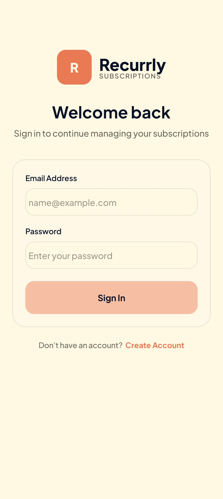
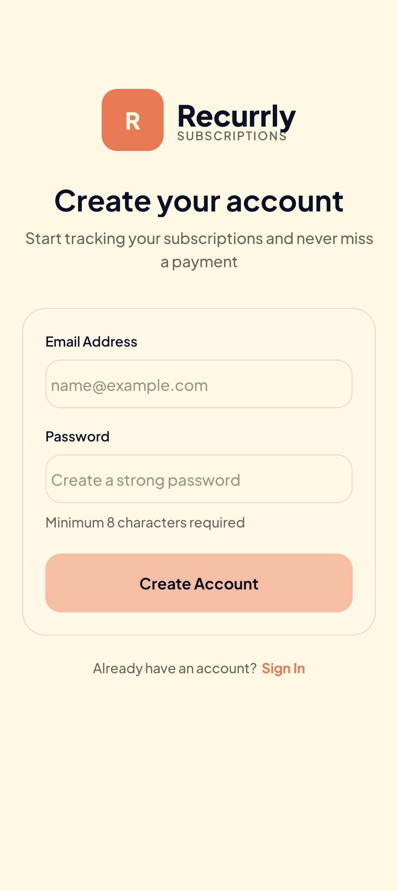
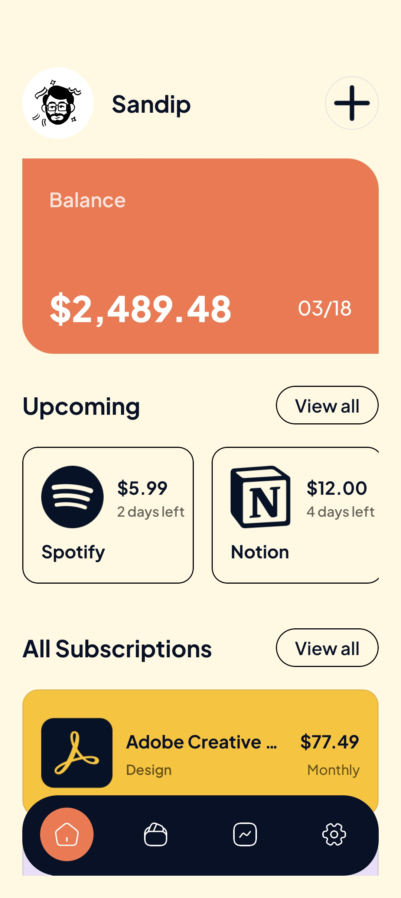
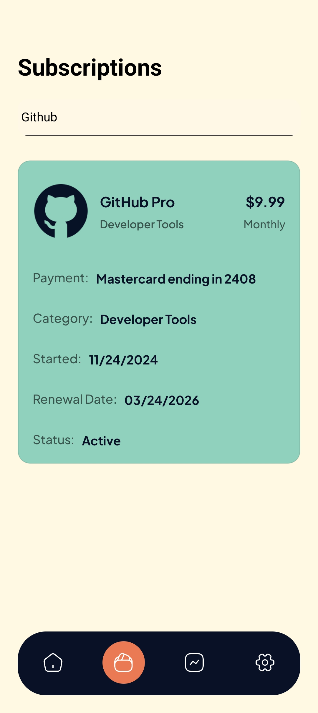
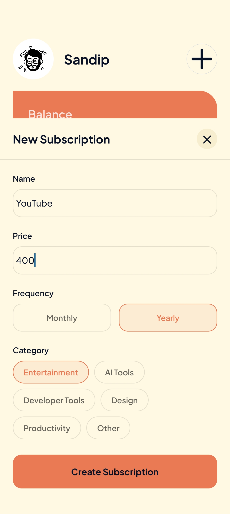
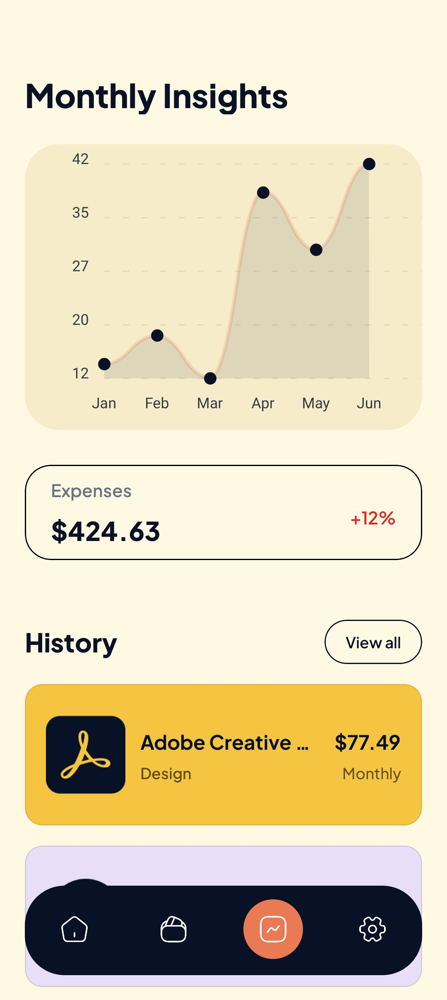
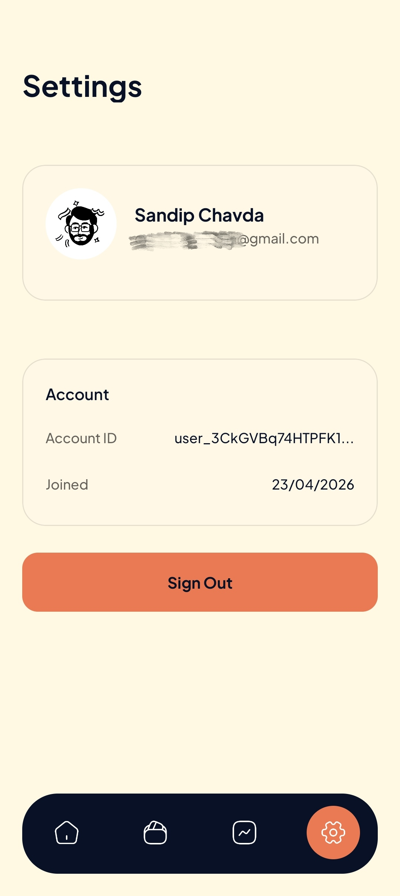

# 📱 Recurrly - Subscription Management App

### 🚀 Overview

Managing multiple subscriptions can quickly become overwhelming---users
often lose track of recurring expenses and lack visibility into spending
trends.

Recurrly+ solves this by providing a clean, mobile-first interface to: -
Track subscriptions - Categorize expenses - Visualize spending patterns

This project extends a base implementation by adding analytics and
onboarding flows, focusing on improving user experience and usability.

## 🎥 Demo

<div align="center">
  
https://github.com/user-attachments/assets/1e9166ee-ed03-4021-829f-ed6d80d01fbb

</div>

## 📱 Screenshots

<div align="center">

<table>
  <tr>
    <td align="center">
      <b>Login</b><br/>
      
    </td>
    <td align="center">
      <b>Account Create</b><br/>
      
    </td>
    <td align="center">
      <b>Onboarding</b><br/>
      
    </td>
    <td align="center">
      <b>Home</b><br/>
      
    </td>
  </tr>

  <tr>
    <td align="center">
      <b>Search</b><br/>
      
    </td>
    <td align="center">
      <b>Add Subscription</b><br/>
      
    </td>
    <td align="center">
      <b>Insights</b><br/>
      
    </td>
    <td align="center">
      <b>Profile</b><br/>
      
    </td>
  </tr>
</table>

</div>

## 🏗️ Tech Stack

<b>Frontend:</b> - React Native (Expo) - TypeScript - NativeWind

<b>Backend & Services:</b> - Clerk (Authentication)

<b>Other:</b> - Charting library - Expo Router

## 🧠 Problem → Solution

### Problem

- Users forget active subscriptions
- No clear visibility into monthly spending trends
- Poor onboarding in many finance apps

### Solution

- Centralized subscription dashboard
- Category-based organization
- Insights screen for expense visualization
- Onboarding flow for better user guidance

## ✨ Features

### 📦 Core Features (Base)

- Add and manage subscriptions
- Categorize expenses
- Monthly / yearly billing support
- Authentication & user profile
- Clean, responsive UI

---

### 🆕 My Enhancements

#### 📊 Insights Screen UI

- Monthly expense trend visualization
- Expense growth indicators
- Structured history section
- Focus on readability and data clarity

#### 🧭 Onboarding Flow

- Introduced first-time user experience
- Improves usability and reduces friction

#### ⚙️ UI Enhancements

- Improved settings screen structure
- Better component organization
- Consistent design system usage

## ⚙️ Installation

```bash
git clone https://github.com/Sandip-Chavda/Recurrly_React_Native.git
cd your-repo


npm install
npx expo start
```

## 📈 What I Learned

- Extending existing codebases with new features
- Designing consistent UI across multiple screens
- Integrating analytics UI into mobile apps
- Improving user onboarding experience
- Structuring reusable components

## 🔮 Future Improvements

- Edit/Delete subscriptions
- Push notifications for billing reminders
- Backend expansion
- Advanced filtering & search

## 🙏 Credits

Inspired by a tutorial by JS Mastery (Adrian Hajdin). Extended with additional UI
features and improvements independently.
